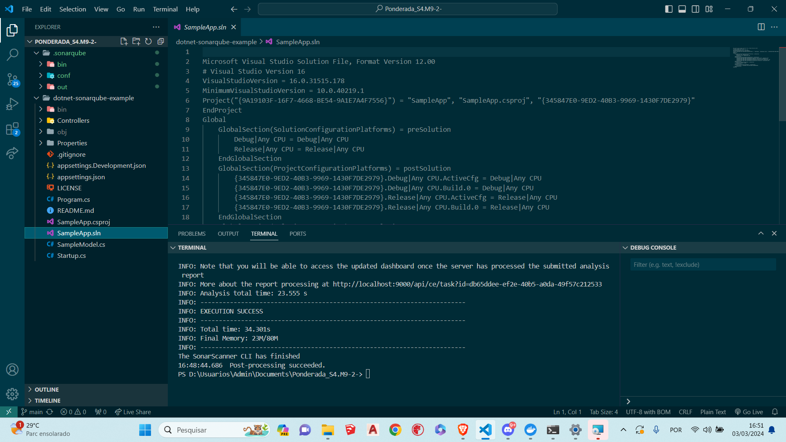
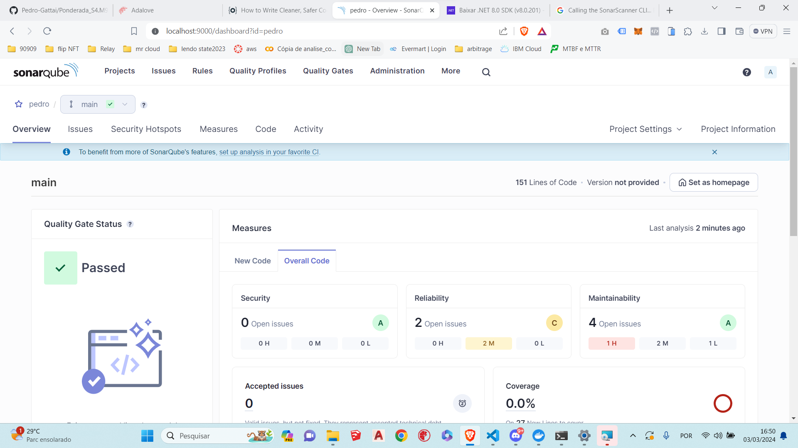

# Docs
Ao seguir o tutorial "Continuous Code Quality with SonarQube and .NET" da Okta, aprendi uma série de habilidades e conceitos valiosos que contribuíram significativamente para o meu desenvolvimento como programador .NET. Primeiramente, compreendi a importância essencial da qualidade do código em qualquer projeto de software. Aprendi como a qualidade do código não apenas afeta a manutenibilidade e a segurança do software, mas também sua escalabilidade e robustez.

Explorar detalhadamente o SonarQube e sua aplicação em projetos .NET foi uma parte fundamental do aprendizado. Aprendi a interpretar as métricas e análises estáticas fornecidas pelo SonarQube, permitindo-me identificar e corrigir problemas de código com maior eficiência. Além disso, compreendi como integrar o SonarQube em fluxos de trabalho de desenvolvimento, tornando a análise de código uma parte essencial do processo de integração contínua.

Ao longo do tutorial, fui capacitado a entender como interpretar os dados fornecidos pelo SonarQube e aplicar esse conhecimento na melhoria contínua da qualidade do código. A habilidade de identificar e corrigir problemas de código com base no feedback do SonarQube não apenas elevou o padrão do meu código, mas também contribuiu para uma cultura de excelência em qualidade de código.

Em resumo, o tutorial proporcionou uma base sólida para aprimorar a qualidade do meu código em projetos .NET, capacitando-me a produzir software mais confiável, seguro e de fácil manutenção.

# Codigo funcionando

Na primeira imagem vemos o codigo em execucao no terminal.

Na segunda imagem vemos o dashboard do Sonarqube rodando na porta 9000, como tambem e possivel ver algumas informacoes sobre a analise do codigo.
